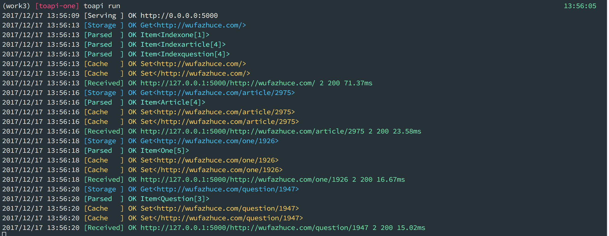
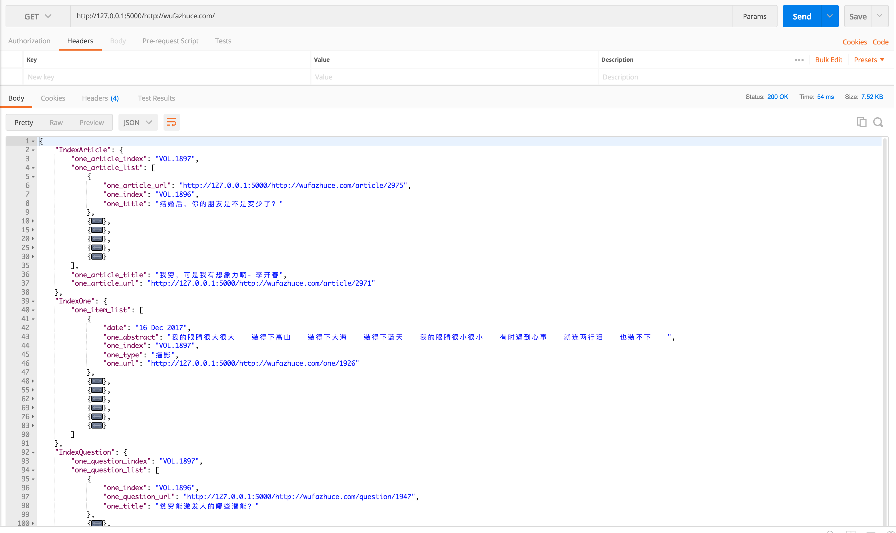
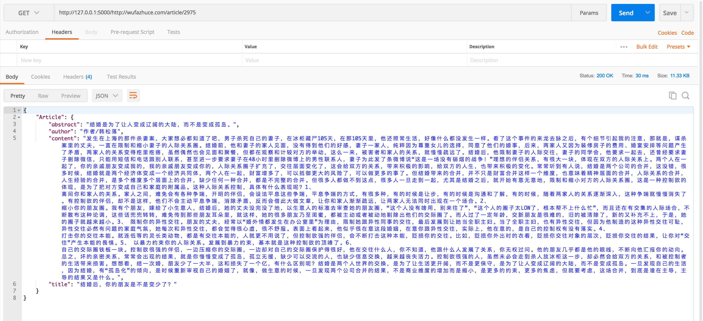
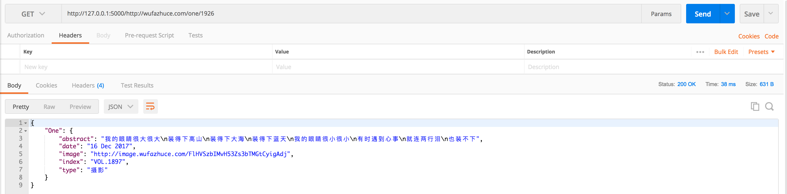
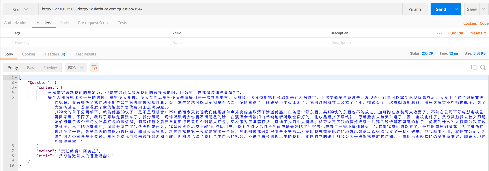

## toapi-one

### What is toapi-one?

This project uses [Toapi](https://github.com/gaojiuli/toapi) to build a friendly and robust API from [one](http://wufazhuce.com/).


``` shell

# or git clone https://github.com/toapi/toapi-one
toapi new toapi/toapi-one
cd toapi-one
# toapi run
python wsgi.py
```

Then, everything is done, the following content will show on screen:



### Usage:

Once the server is started, you can get JSON data from toapi-one, now toapi-one can:

- index
    - article
    - one
    - question
- article_info
- one_info
- question_info

Visit `http://0.0.0.0:5000/items/`

#### index


#### article_info


#### one_info


#### question_info


### Deploy:

We recommend that you use Caddy(Nginx) + Gunicorn
